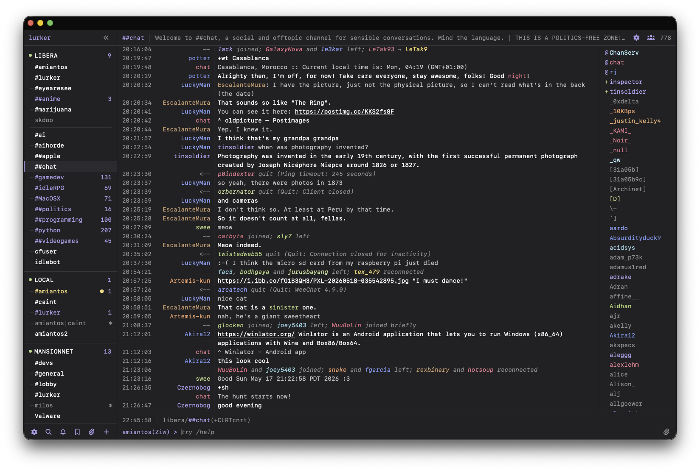

<h1>
  &nbsp;&nbsp;Lurker
</h1>

[](https://github.com/amiantos/lurker/actions/workflows/test.yml)
[](https://github.com/amiantos/lurker/pkgs/container/lurker)
[](https://codecov.io/github/amiantos/lurker)
[](https://scorecard.dev/viewer/?uri=github.com/amiantos/lurker)
[](LICENSE)
[](https://web.libera.chat/#lurker)

Lurker is a self-hosted modern IRC client with a retro flair, most easily described as "your personal [IRCCloud](https://www.irccloud.com), with [Weechat](https://weechat.org) looks".

Lurker runs as an always-on server that stays connected to IRC on your behalf, keeps full message history, and lets you reattach from any browser — desktop or mobile — picking up exactly where you left off. Open it on as many devices and tabs as you like; read state, settings, and history stay in sync everywhere; when all clients are disconnected, auto-away sets your status, and web push notifications inform you of highlights. Oh, and the icon rules.

# Features

- **Always-on and multi-user.** Each invited user connects to their own set of IRC networks, and Lurker stays connected when they're away.
- **Full history and search.** Every message is stored _and_ searchable. Auto-away triggers after your last client disconnects, and smart push notifications fire on highlights.
- **IRC with Modern Convienences.** Peer presence, automatic nick regain, join/part summarization, tab nickname completion, message drafts, saved messages, user notes, and a searchable channel browser w/ cache.
- **Image uploads.** Paste, drag, or pick an image; Lurker optimizes it, uploads it to [x0.at](https://x0.at) or [catbox.moe](https://catbox.moe), inserts the link into your message, and keeps a history of all your uploads.
- **Customizable UI.** The beautiful retro terminal-style interface has 40+ settings to customize it how you want, and you can freely pin and rearrange channels and DMs.
- **Installable.** Lurker is a PWA — install it as a native-feeling app on your phone, Mac, or PC straight from the browser.

# Fork additions

This fork extends upstream Lurker with split-window panes, Slack support,
iMessage support, and a richer composer. The full, itemized list is in
[CHANGELOG.md](CHANGELOG.md); the highlights:

- **Split-window panes (desktop).** Open several buffers side by side in an
  auto-wrapping grid, with one shared input bound to the focused pane.
  Right-click a buffer and choose "Open in Split" to add a pane.
- **Slack support.** Slack is a first-class provider alongside IRC. A
  `SlackConnection` implements the same connection contract as the IRC adapter,
  so the server, history/read-state, and the entire Vue client drive it
  unchanged. It covers:
  - Connecting via an "Add to Slack" OAuth flow or by pasting bot/app tokens.
  - Channels, DMs, and group DMs as buffers, with history backfill, live
    messages, sending, typing indicators, and member lists.
  - Threads in a live side-pane, reactions (including click-to-toggle and an
    add-reaction picker), file and image attachments, message edits and
    deletes, presence, page-up history, mark-as-read sync, and whole-workspace
    search.
  - Slack markup and Block Kit rendering, app/bot real names, and
    workspace-custom emoji in both the message view and the composer.
  - A credential-free demo mode (sentinel `demo` tokens) that exercises the
    whole path without a real workspace.
- **iMessage support.** A third provider alongside IRC and Slack, via a
  self-hosted [BlueBubbles](https://bluebubbles.app) server running on a Mac.
  The Lurker server talks to it over HTTP + Socket.IO; the client renders
  iMessage chats exactly like IRC and Slack. It covers 1:1 and group chats as
  buffers, history, live messages, sending, tapbacks as reaction chips, image
  and file attachments, and mark-as-read sync — plus a credential-free demo
  mode.
- **Composer.** ASCII emoticons (`:)`, `<3`, `:D`, ...) auto-convert to emoji as
  you type, and the `:shortcode:` autocomplete now also surfaces a Slack
  workspace's custom emoji.
- **Rich media (all providers).** Links to Spotify, YouTube, news sites, etc.
  unfurl into preview cards (server-side, SSRF-guarded, fetched lazily as they
  scroll into view), and video attachments play inline.

Slack OAuth is configured through the `SLACK_*` environment variables documented
in [`.env.example`](.env.example); without them, Slack networks are added by
pasting tokens in the network form.

# Screenshot (as macOS PWA)



# Rave Reviews

- `<cfuser> amiantos: holy shit, you made something better than irccloud`
- `<amigojapan> great, now that amiantos's chat client is catching up to IRC cloud, I think I can switch to it as my daily driver`
- `<skdoo> amiantos makes cool shit`
- `<jadeia> lurker is really nice. this is streets ahead of irccloud in terms of design and ease of use.`

# Stack

- **Server** — TypeScript on Node (run via `tsx`), Express, `irc-framework`, `ws`, `better-sqlite3`, `sharp`, `web-push`, `@slack/web-api`, `@slack/socket-mode`, `socket.io-client`
- **Client** — TypeScript, Vue 3, Vite, Pinia, `vue-router`
- **Tooling** — Vitest, oxlint, oxfmt

# Installation

## Install (Docker)

```bash
curl -O https://raw.githubusercontent.com/amiantos/lurker/main/docker-compose.yml
docker compose up -d
```

Then open <http://localhost:8015> and create your admin account. Username + password is the default; passkeys are optional. See [SELF_HOSTING.md](docs/SELF_HOSTING.md) for the full guide — reverse proxy + HTTPS, enabling passkeys, push notifications, updating, and backups.

## Lurker.Chat Managed Hosting

Don't want to run a server yourself? **[Lurker.Chat](https://lurker.chat)** is official managed hosting: an always-on Lurker instance with backups, updates, and HTTPS handled for you — **$5/mo**, with a 14-day money-back guarantee.

## Deploy on DigitalOcean

Stand up a public, HTTPS-enabled Lurker on a fresh droplet from a single pasted script — no SSH required, with passkeys, web push, and TLS all configured for you. Step-by-step instructions are in **[docs/digitalocean.md](docs/digitalocean.md)**.

## Manual Install (without Docker)

```bash
npm run install:all
npm run client:build
npm start
```

The server listens on port 8010 by default and stores everything in `./data/`. Override with the envvars documented in [`.env.example`](.env.example).

## Development

```bash
npm run install:all
cp .env.example .env   # defaults assume the local hostname documented in the file
npm run dev
```

# Documentation

- **[Self-hosting guide](docs/SELF_HOSTING.md)** — reverse proxy + HTTPS, passkeys, web push, updating, backups, and troubleshooting.
- **[Deploy on DigitalOcean](docs/digitalocean.md)** — the one-shot droplet walkthrough.
- **[MCP & HTTP API](docs/MCP.md)** — drive Lurker from agents, scripts, or other external tools.

# Community

- Chat in **#lurker** on [Libera.Chat](https://libera.chat).
- Discuss Lurker and read my devlog over on [The Eye of Providence](https://discuss.bradroot.me/tags/c/projects/13/lurker/39).
- Say hi — I'm **amiantos** on Libera.Chat and [MansionNET](https://inthemansion.com).

# License

Mozilla Public License 2.0 — see [LICENSE](LICENSE).
